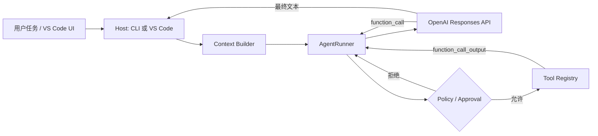

# Simple Code Agent

一个用于研究 Agent 原理的最小 TypeScript Code Agent。它直接基于 OpenAI Responses API 的 function calling 实现，不依赖 LangChain 等 Agent 框架，因此模型调用、工具循环、上下文注入、权限审批和终止条件都能在源码中直接看到。

## 它实现了什么

- Responses API 的多轮工具调用循环，并通过 `previous_response_id` 延续交互式会话
- 七个基础工具：`list_directory`、`read_file`、`search_code`、`write_file`、`replace_in_file`、`delete_file`、`run_command`；发现 Skill 时额外注册 `load_skill`
- 写文件和执行进程前的人机审批；`--yes` 可用于受信环境
- 工作区路径限制、符号链接逃逸检查、常见密钥文件拦截
- 测试子进程会移除名称类似 token、secret、password、API key 的环境变量
- `AGENTS.md` / `AGENTS.override.md` 项目指令加载
- Markdown 文档目录：只注入路径和标题，需要时再读取正文
- 本地 Skill 目录：只注入名称和描述，需要时通过 `load_skill` 加载完整 `SKILL.md`
- `--debug` 将每次 OpenAI 原始请求和完整响应写入私有 JSONL 日志
- 可替换的 `ModelAdapter`，测试使用假模型，不消耗 API 调用

## 运行原理



核心循环位于 `src/core/agent-runner.ts`：

1. 把任务、系统指令和工具 JSON Schema 发给模型。
2. 如果模型返回 `function_call`，解析并用 Zod 校验参数。
3. 读操作直接执行；写操作和进程执行先交给 `ApprovalPolicy`。
4. 把结构化工具结果作为 `function_call_output` 发回模型。
5. 模型不再调用工具时结束；超过最大轮数则强制停止。

这个流程对应 OpenAI 官方的 [function calling 工具循环](https://developers.openai.com/api/docs/guides/function-calling)。

## 快速开始

要求 Node.js 20 或更高版本。

```bash
npm install
export OPENAI_API_KEY="your-api-key"
npm run dev -- --workspace .
```

默认使用模型 `deepseek-v4-flash` 和兼容 Responses API 的 Base URL `https://ark.cn-beijing.volces.com/api/plan/v3`。仍可通过 `--model` 和 `OPENAI_BASE_URL` 覆盖：

```bash
export OPENAI_BASE_URL="https://provider.example.com/v1"
npm run dev -- --workspace . --model "provider-model"
```

启动后输入自然语言任务：

```text
Interactive mode. Type /help for commands.
agent> 阅读这个项目，说明 Agent 的工具调用链路
assistant> ...

agent> 继续解释工具审批是怎么实现的
assistant> ...
```

也可以执行一次性任务，输出结果后立即退出：

```bash
npm run dev -- --workspace /path/to/project "修复失败的单元测试"
```

如果既提供初始任务又希望继续对话，使用：

```bash
npm run dev -- --interactive "先介绍项目结构"
```

CLI 会在每次 `write_file`、`replace_in_file`、`delete_file` 和 `run_command` 前显示参数并询问。查看全部选项：

```bash
npm run dev -- --help
```

## 通用命令执行

模型可以通过一个结构化的 `run_command` 工具运行构建、测试和版本控制命令，不需要为 CMake、Make、Git、Cargo 等程序分别定义 function：

```json
{
  "program": "cmake",
  "args": ["-S", ".", "-B", "build"],
  "cwd": ".",
  "timeoutMs": 600000
}
```

命令使用 Node.js `spawn(program, args, { shell: false })` 执行，因此 `&&`、管道、重定向和变量展开不会被当作 Shell 语法解释。需要连续执行时，模型应发起多个工具调用。

Host 会验证工作目录仍在 workspace 内，移除名称类似 API key、token、secret、password 的环境变量，并限制执行时间和回传输出。`rm`、`sudo`、`git reset --hard`、`git clean`、`find -delete` 以及 `bash -c`、`node -e` 等绕过结构化参数的入口会直接拒绝。其他进程执行仍走人机审批；`--yes` 只跳过审批，不能绕过高危命令策略。

这套策略是教育项目中的防误操作边界，不是完整的操作系统沙箱。对不受信任的仓库执行构建脚本时，还应使用容器或 OS 沙箱限制文件系统和网络访问。

## 交互式会话

每轮成功响应的 `responseId` 会作为下一轮请求的 `previous_response_id`，因此“继续解释”“修改刚才提到的文件”等追问能看到此前上下文。具体机制参考 OpenAI 官方的 [conversation state](https://developers.openai.com/api/docs/guides/conversation-state)。

交互命令：

- `/new`：清空当前会话 ID，下一条消息开启独立对话
- `/help`：显示命令帮助
- `/exit` 或 `/quit`：退出
- `Ctrl+C` 或 `Ctrl+D`：关闭交互输入并退出

`/new` 只重置模型对话，不会撤销已经修改的工作区文件。写文件和运行测试仍然逐次请求审批；`--yes` 会自动批准这些操作。

## 查看 OpenAI 原始请求和响应

使用 `--debug` 启用：

```bash
npm run dev -- --workspace . --debug
```

启动时会显示日志的绝对路径：

```text
agent: raw OpenAI log: /path/to/project/.agent-runs/2026-08-14T15-10-00-000Z-12345.jsonl
```

每次 API 调用产生两行具有相同 `traceId` 的 JSON：

```json
{"type":"openai.request","traceId":"...","endpoint":"https://ark.cn-beijing.volces.com/api/plan/v3/responses","body":{"model":"deepseek-v4-flash","instructions":"...","input":"...","tools":[...]}}
{"type":"openai.response","traceId":"...","requestId":"req_...","durationMs":1234,"http":{"status":200,"headers":{"x-request-id":"req_..."}},"body":{"id":"resp_...","output":[...],"usage":{...}}}
```

请求失败时记录 `openai.error`。日志内容包括完整 instructions、用户输入、工具 Schema、工具结果、模型正文、工具调用和 token usage。它不会记录 API Key、Authorization、Cookie 或 Base URL 中的认证信息。

日志文件权限设置为仅当前用户可读写（`0600`）。由于日志可能包含项目源码和用户数据：

- `.agent-runs/` 已被当前仓库的 `.gitignore` 忽略
- Agent 文件工具也禁止读取 `.agent-runs/`，避免日志再次进入模型上下文
- 对其他目标项目使用 `--workspace` 时，建议把 `.agent-runs/` 加入该项目的 `.gitignore`

可以用 `jq` 格式化查看：

```bash
jq . .agent-runs/*.jsonl
```

### 生成交互流程报告

原始 JSONL 适合排障，但 `instructions`、工具 Schema、模型和 endpoint 会在多轮请求中重复。内置 Trace Viewer 会将日志归一化为“用户输入 → 模型计划/消息 → 工具调用 → 工具结果 → 最终回答”的时间线：

```bash
npm run trace:view -- libevent/.agent-runs/2026-08-14T08-40-16-401Z-63000.jsonl
```

默认在日志旁生成同名 `.html` 文件，也可以指定输出路径：

```bash
npm run trace:view -- run.jsonl --output reports/run.html
```

报告有以下处理：

- 把稳定的 `instructions`、工具定义、endpoint 和模型提升为会话级配置，只展示一次
- 按 `traceId` 配对 request/response，按 `call_id` 把下一轮的工具结果挂回对应调用
- 主时间线只展示任务、模型消息、工具参数摘要、成功/失败结果、耗时和 token
- 配置变化、孤立工具结果和损坏的 JSONL 行会明确标记
- 完整原始 request/response 仍保留在每轮底部的折叠区域

生成的报告是无外部依赖的单文件 HTML，可直接在浏览器中打开；它可能包含源码和模型上下文，因此同样使用 `0600` 文件权限，且不会自动上传或打开。

## 项目 Markdown 如何进入上下文

不同 Markdown 使用两种策略：

1. `AGENTS.md` 是约束，启动时全文注入。若为某个子目录运行 Agent，可沿目录层级加载；同一目录的 `AGENTS.override.md` 优先。
2. `README.md`、`docs/*.md` 等说明文档只把“路径 + 一级标题”放入目录。模型判断相关后再调用 `read_file`，避免大量无关内容占用上下文。

当前 CLI 的工作目录就是 `--workspace` 根目录。宿主以后可调用 `loadProjectInstructions(workspaceRoot, activeFileDirectory)`，从而让 VS Code 当前文件所在目录的指令生效。

## 公共 Skill 如何注册

Skill 的目录结构：

```text
<skill-root>/
└── code-review/
    └── SKILL.md
```

`SKILL.md` 推荐包含元数据：

```markdown
---
name: code-review
description: Review code for correctness and missing tests.
routing: Review code and identify missing tests.
---

# Workflow
...
```

Agent 默认扫描：

- 项目内的 `<workspace>/.agents/skills`
- 当前用户的 `~/.agents/skills`
- 环境变量 `CODE_AGENT_SKILL_ROOTS` 中的目录
- 重复的 `--skill-root <path>` 参数

例如加载仓库里的示例 Skill：

```bash
npm run dev -- --skill-root ./examples/skills '$code-review 检查当前实现'
```

启动阶段只向模型提供 Skill 名称和不超过 80 字符的 `routing`；没有 `routing` 时使用截短的 `description`。模型使用下面的调用读取 Skill 入口：

```json
{ "name": "code-review", "resource": null }
```

如果 `SKILL.md` 引用了同一 Skill 目录下的其他文件，仍通过 `load_skill` 渐进读取：

```json
{ "name": "code-review", "resource": "references/checklist.md" }
```

资源路径以对应 Skill 目录为根，不能通过绝对路径、`..` 或符号链接逃逸。机器公共目录可这样配置：

```bash
export CODE_AGENT_SKILL_ROOTS="/usr/local/share/code-agent/skills"
```

## 为什么第一版不用 Agent 框架

研究原理时，手写循环更合适：本项目核心只有模型适配器、循环、工具注册表、策略和上下文构建器。理解这些边界以后，可以保持工具与策略不变，把 `OpenAIModel` 替换为 OpenAI Agents SDK 或其他框架的适配器，再比较 tracing、handoff、memory 和 MCP 带来的价值。

## 接入 VS Code

VS Code 扩展只应作为 Host，复用这里的核心包：

- Webview/Chat Participant 收集任务并展示 `AgentEvent`
- `workspace.workspaceFolders` 提供 `workspaceRoot`
- `window.activeTextEditor` 提供当前文件目录，用于分层加载 `AGENTS.md`
- `window.showWarningMessage` 实现 `ApprovalPolicy`
- `WorkspaceEdit` 可以替换当前的文件写工具，以获得 diff 预览和 Undo
- `CancellationToken` 映射到 AgentRunner 的取消信号（可作为下一步练习）

不要把 OpenAI API Key 写进扩展源码；应使用 VS Code `SecretStorage`，或者让扩展连接一个本地/远端后端。

## 验证

```bash
npm run typecheck
npm test
npm run build
```

测试覆盖工具调用回传、审批拒绝、轮数上限、路径逃逸、敏感文件、精确替换、项目指令、Markdown 目录和 Skill 发现。

## 代码导航

- `src/core/agent-runner.ts`：Agent 状态机和工具循环
- `src/cli/interactive-session.ts`：跨轮 responseId、交互命令和会话重置
- `src/logging/`：OpenAI 原始请求/响应的 JSONL 调试日志
- `src/model/openai-model.ts`：Responses API 适配器
- `src/tools/`：工具定义、参数 Schema 和执行逻辑
- `src/context/`：项目说明、Markdown 和 Skill 上下文
- `src/policy/`：审批及工作区安全边界
- `src/cli/main.ts`：CLI Host，可作为 VS Code Host 的参考
- `tests/`：不调用真实模型的行为测试
