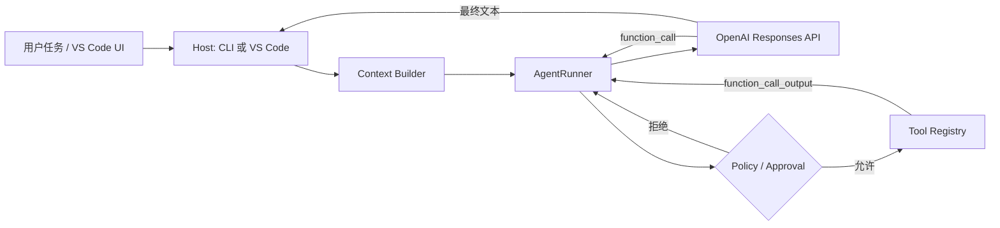

# Simple Code Agent

一个用于研究 Agent 原理的最小 TypeScript Code Agent。它直接基于 OpenAI Responses API 的 function calling 实现，不依赖 LangChain 等 Agent 框架，因此模型调用、工具循环、上下文注入、权限审批和终止条件都能在源码中直接看到。

## 它实现了什么

- Responses API 的多轮工具调用循环；历史会话从本地记录恢复，当前运行中通过 `previous_response_id` 串联请求
- 默认启用 `parallel_tool_calls`，允许模型在一轮中返回多个工具调用；Host 按模型顺序逐个校验、审批和执行
- 两个工具：`apply_patch`、`run_command`
- 普通文件和 Skill 文件均通过命令行读取相关行范围。工具输出超出上下文预算时优先压缩正文并保留结构化字段
- 文件读取、搜索和目录查看统一通过 `run_command`：优先使用 `rg` 搜索文本、`rg --files` 查找文件、`ls`（PowerShell 使用 `Get-ChildItem`）查看目录；随包提供 Windows/macOS 的 x64、ARM64 版 rg
- 工作区内的 `apply_patch` 由宿主策略自动批准；`run_command` 支持逐次审批和受信环境下的 `--yes`
- `apply_patch` 的工作区路径限制、符号链接逃逸检查、常见密钥文件拦截
- `AGENTS.md` / `AGENTS.override.md` 项目指令加载
- Markdown 文档目录：只注入路径和标题，需要时再读取正文
- 本地 Skill 目录：在 8,000 字符预算内提供名称、描述和绝对路径；超过预算时通过完整索引搜索，再按需读取 `SKILL.md`
- 会话过程默认写入 `.agent-runs/<会话 ID>.jsonl`，恢复历史和 Trace Viewer 共用同一文件；`--debug` 追加原始请求、响应、SSE 和异常详情
- 默认通过 Responses API 事件流实时显示推理摘要和回答正文，使用 `--no-stream` 可关闭流式输出
- 可替换的 `ModelAdapter`，测试使用假模型，不消耗 API 调用

## 运行原理



核心循环位于 `src/core/agent-runner.ts`：

1. 把任务、系统指令和工具 JSON Schema 发给模型。
2. 如果模型返回一个或多个 `function_call`，按顺序解析并用 Zod 校验参数。
3. 每个工具调用先交给 `ApprovalPolicy`，批准后执行，再处理下一个调用。工作区文件操作由宿主策略自动批准，`run_command` 交给用户确认。
4. 把结构化工具结果作为 `function_call_output` 发回模型。
5. 模型不再调用工具时结束；超过最大轮数则强制停止，默认上限为 300 轮。

这个流程对应 OpenAI 官方的 [function calling 工具循环](https://developers.openai.com/api/docs/guides/function-calling)。

## 快速开始

要求 Node.js 20 或更高版本。

```bash
npm install
npm run dev -- --workspace .
```

启动前创建当前目录的 `.config/config.json`，启动时会从中加载连接设置。配置是一个数组，每项是一组 API key、地址和可用模型：

```json
[
  {
    "apiKey": "your-ark-api-key",
    "baseUrl": "https://ark.cn-beijing.volces.com/api/plan/v3",
    "models": ["deepseek-v4-flash", "glm-5.3"],
    "reasoningSummary": "auto"
  },
  {
    "apiKey": "your-other-api-key",
    "baseUrl": "https://provider.example.com/v1",
    "models": ["provider-model"],
    "reasoningSummary": "off"
  }
]
```

默认使用第一组配置的第一个模型。`/model` 会列出所有组的模型，使用 `/model <序号或模型名>` 选择模型时，会同时使用该组的 `apiKey`、`baseUrl` 和 `reasoningSummary`。同名模型通过配置编号区分，例如 `1:shared-model`、`2:shared-model`；也可以直接按 `/model` 列表中的序号选择。

每组的 `reasoningSummary` 控制是否请求并显示推理摘要，可选值为 `off`、`auto`、`concise` 或 `detailed`，省略时默认为 `auto`。

`.config/` 已被 Git 忽略，`apply_patch` 禁止修改其中的文件。命令行读取不受这层文件路径策略限制，应在审批时检查读取范围。

CLI 优先显示 API 返回的 reasoning summary。部分兼容接口（例如启用了 reasoning parser 的 vLLM）会改为返回 `reasoning_text`；此时 CLI 会显示接口明确提供的原始推理文本，HTML 运行报告也会将它标记为 `reasoning text`。这类内容可能包含完整思考过程，请注意 console 输出和 `.agent-runs/` 日志的访问范围。如果兼容接口明确拒绝 reasoning summary 参数，CLI 会提示一次，移除该参数后发起一次兼容降级请求，并在当前进程内不再为该模型请求摘要。

启动后在 `agent>` 输入自然语言任务：

```text
Interactive mode. Type /help for commands.
agent> 阅读这个项目，说明 Agent 的工具调用链路
thinking> 我需要先查看项目结构以及 AgentRunner 的实现。
assistant> ...

agent> 继续解释工具审批是怎么实现的
assistant> ...
```

默认开启流式输出，实时显示推理摘要和回答正文。需要等待完整响应再显示时，可以显式关闭：

```bash
npm run dev -- --workspace . --no-stream
```

流式模式只实时展示增量内容；工具调用仍会等待完整参数生成后再校验和审批，历史记录也只在收到最终响应后保存。

CLI 默认批准 workspace 内的 `apply_patch`；每次 `run_command` 都会显示命令并询问。查看全部选项：

```bash
npm run dev -- --help
```

## 通用命令执行

模型通过 `run_command` 完成文件读取、目录查看、文件查找、文本搜索、构建、测试和版本控制，不需要为 rg、CMake、Make、Git、Cargo 等程序分别定义 function：

```json
{
  "command": "cmake -S . -B build && cmake --build build",
  "cwd": ".",
  "timeoutMs": 600000
}
```

`run_command` 接收完整的 Shell 命令字符串。Windows 使用无 Profile 的非交互 PowerShell；macOS 使用 `$SHELL`（未设置时回退 `/bin/zsh`），同样以非交互模式启动。当前 Shell 的名称和路径会写入模型 instructions，因此模型会使用对应语法。`&&`、管道、重定向、变量和其它 Shell 语法会直接交给 Shell 解析。

项目在 `vendor/ripgrep/` 中预置 ripgrep 15.2.0，覆盖 Windows x64/ARM64 和 macOS Intel/Apple Silicon。`run_command` 根据当前 Node.js 进程的平台和架构，将对应目录加入子进程 `PATH` 前面，因此这些平台无需单独安装 rg，运行时也无需下载。源码运行和编译后的 npm 包使用同一组二进制；其他平台沿用系统 `PATH`。

常用搜索和读取命令（以下示例使用 Unix Shell）：

```bash
rg --files src -g '*runner*'
rg -l -F -- 'AgentRunner' src
rg -n -F -C 3 -- 'AgentRunner' src/core
ls src
cat package.json
sed -n '1,160p' src/core/agent-runner.ts
```

模型先定位仓库或模块，再收窄搜索范围；默认遵循命令自身的忽略规则。`rg` 退出码 1 表示没有匹配，2 表示执行错误。输出截断时应缩小范围后重新搜索。PowerShell 使用 `Get-Content file.txt | Select-Object -Skip 20 -First 40` 读取行范围。文件读取、搜索与目录查看同样经过 `run_command` 的宿主审批。

Host 验证 `run_command` 的工作目录仍在 workspace 内，并限制执行时间和回传输出。每次调用都会交给 Host 审批；交互提示中输入 `y` 仅批准本次，输入 `n` 或直接回车则拒绝。受信环境可以使用 `--yes` 跳过 `run_command` 确认。`apply_patch` 只能修改 workspace 内允许的文件路径，默认由宿主策略批准。命令字符串中的文件路径不受 `apply_patch` 的路径过滤限制。

这套策略是教育项目中的防误操作边界，不是完整的操作系统沙箱。对不受信任的仓库执行构建脚本时，还应使用容器或 OS 沙箱限制文件系统和网络访问。

## 文件修改

`apply_patch` 统一负责创建、局部编辑、移动和删除文件，替代原先的三个写文件工具。它沿用 JSON function calling，参数只有 `{ "patch": "补丁正文" }`，兼容当前 Responses API 适配器。补丁正文使用以下语法：

```diff
*** Begin Patch
*** Add File: src/greeting.ts
+export const greeting = "hello";
*** Update File: src/example.ts
@@
-export const answer = 42;
+export const answer = 43;
*** Delete File: src/obsolete.ts
*** End Patch
```

移动文件时，在 `*** Update File: 原路径` 后添加 `*** Move to: 新路径`，可同时附带修改块。`@@ 文本` 从精确匹配的行之后寻找修改位置；`*** End of File` 要求修改块匹配到文件末尾。上下文行以空格开头，删除行以 `-` 开头，新增行以 `+` 开头。

工具先校验整份补丁、路径和修改上下文，再执行写入。上下文不匹配或有歧义、创建或移动的目标已存在、目标路径冲突时会拒绝执行。新增文件会创建缺失的父目录；更新会保留 LF/CRLF 风格和文件末尾换行状态。补丁限 1 MB、100 个文件操作，待更新及更新后的文件均限 1 MB；更新只支持 UTF-8 文本。

这不是多文件事务：实际写入期间发生 I/O 错误时，工具会报告已完成的操作和可能发生修改的路径。写入仍先交给 `ApprovalPolicy`，默认 CLI 策略自动批准 `apply_patch`，其他宿主可以拒绝或逐次审批。

## 交互式会话

当前进程连续处理同一会话时，成功响应的 `responseId` 会作为后续请求的 `previous_response_id`。这个续接 ID 只从当前运行的响应中取得。具体机制参考 OpenAI 官方的 [conversation state](https://developers.openai.com/api/docs/guides/conversation-state)。

会话从第一条用户输入开始保存在工作区的 `.agent-runs/<会话 ID>.jsonl` 中，无需开启 `--debug`。用户输入、每次完整模型响应、工具结果和任务结束状态按发生顺序追加写入；重新打开同一会话后继续追加原文件。启动时可以输入历史序号或 ID 前缀继续，也可以输入 `0` 开启新对话。

启动时选择历史会话或使用 `/resume`，都会从本地记录回放消息、工具调用、工具结果及模型返回的 reasoning 项，首次请求不携带旧 `previous_response_id`。日志中的 response ID 只用于排障，恢复不要求存在这个字段。恢复后输入“继续”即可继续任务；已完成工具不会由恢复逻辑重新执行，缺少结果的工具会被标记为执行结果未知，交给模型核实。请求失败时保留当前进度，下一次输入从本地上下文继续。

每个会话包含标题、模型、时间和运行状态。默认标题取第一条用户消息的前 60 个字符，使用 `/rename` 可以修改。历史按工作区隔离。旧 `.agent-history/*.json` 会在列出历史时导入新目录，原文件保留；导入不会覆盖已存在的新会话。旧格式只含最终问答，无法补回当时未保存的工具过程。

交互命令：

- `/model`：显示当前模型以及 `.config/config.json` 所有连接中的可用模型
- `/model <序号或名称>`：切换模型及其 API 连接，并开启新对话，例如 `/model 2` 或 `/model glm-5.3`
- `/history`：列出当前工作区保存的历史会话
- `/resume <序号或 ID 前缀>`：切换到某一个历史会话
- `/rename <标题>`：重命名当前历史会话
- `/trace`：把当前或最近的 `.agent-runs/*.jsonl` 生成为 HTML，并用系统默认浏览器打开
- `/new`：保留当前历史并让下一条消息开启独立对话
- `/help`：显示命令帮助
- `/exit` 或 `/quit`：退出
- `Ctrl+C` 或 `Ctrl+D`：关闭交互输入并退出

`/new` 和 `/resume` 只切换模型对话，不会撤销已经修改的工作区文件。工作区内的新建、修改和删除文件会自动批准；`run_command` 仍需逐次确认，`--yes` 可跳过确认。

`.agent-runs/` 是会话历史与调试记录的统一目录，已被当前仓库的 Git 忽略。

## 会话记录与调试

默认记录 `session.created`、`session.turn_started`、`session.model_requested`、`session.model_response`、`session.tool_output`、`session.turn_completed` / `session.turn_failed` 和重命名事件。工具结果在产生后立即保存，不必等待下一次 API 请求或整次任务完成。

`/trace` 读取当前会话文件并生成 HTML；尚未选择会话时读取最近的日志。默认记录已经能够展示任务、模型输出、工具调用及其结果。恢复会话的上下文只使用完整的会话记录，不会把调试分片重复加入消息历史。

需要排查模型服务时使用：

```bash
npm run dev -- --workspace . --debug
```

`--debug` 在同一会话文件中额外追加：

- `openai.request`：原始请求体及 endpoint。
- `openai.response`：完整响应、HTTP 元数据与 token usage。
- `openai.stream`：逐条 SSE 事件，包括断流前收到的内容。
- `openai.error`：错误、堆栈及直接 `cause`（如底层 socket 错误）。

调试事件通过 `traceId` 关联一次 API 请求，并通过 `turnId` 和 `step` 关联会话步骤。Trace Viewer 合并同一步骤的基础记录和 debug 记录，原始请求、响应仍可展开查看。旧的时间戳命名 debug JSONL 仍可查看，但不会自动作为可恢复会话导入。

文件权限为 `0600`。SDK 的认证请求头不会写入 debug 日志；请求内容可能包含源码、用户输入和工具输出。为其他工作区运行时，也应把 `.agent-runs/` 加入该项目的 `.gitignore`。

可以用 `jq` 格式化查看：

```bash
jq . .agent-runs/*.jsonl
```

### 生成交互流程报告

原始 JSONL 适合排障，但 `instructions`、工具 Schema、模型和 endpoint 会在多轮请求中重复。内置 Trace Viewer 会将日志归一化为“用户输入 → 模型计划/消息 → 工具调用 → 工具结果 → 最终回答”的时间线：

```bash
npm run trace:view -- libevent/.agent-runs/2026-08-14T08-40-16-401Z-63000.jsonl
```

默认在日志旁生成同名 `.html` 文件，也可以指定输出路径：

```bash
npm run trace:view -- run.jsonl --output reports/run.html
```

报告有以下处理：

- 把稳定的 `instructions`、工具定义、endpoint 和模型提升为会话级配置，只展示一次
- 按 `traceId` 配对 request/response，按 `call_id` 把下一轮的工具结果挂回对应调用
- 主时间线只展示任务、模型消息、工具参数摘要、成功/失败结果、耗时和 token
- 配置变化、孤立工具结果和损坏的 JSONL 行会明确标记
- 完整原始 request/response 仍保留在每轮底部的折叠区域

生成的报告是无外部依赖的单文件 HTML，可直接在浏览器中打开；它可能包含源码和模型上下文，因此同样使用 `0600` 文件权限，且不会自动上传或打开。

## 项目 Markdown 如何进入上下文

不同 Markdown 使用两种策略：

1. `AGENTS.md` 是约束，启动时全文注入。若为某个子目录运行 Agent，可沿目录层级加载；同一目录的 `AGENTS.override.md` 优先。
2. `README.md`、`docs/*.md` 等说明文档只把“路径 + 一级标题”放入目录。模型判断相关后再通过 `run_command` 读取相关行范围，避免大量无关内容占用上下文。

当前 CLI 的工作目录就是 `--workspace` 根目录。宿主以后可调用 `loadProjectInstructions(workspaceRoot, activeFileDirectory)`，从而让 VS Code 当前文件所在目录的指令生效。

## 公共 Skill 如何注册

Skill 的目录结构：

```text
<skill-root>/
└── code-review/
    └── SKILL.md
```

`SKILL.md` 推荐包含元数据：

```markdown
---
name: code-review
description: Review code for correctness and missing tests.
routing: Review code and identify missing tests.
---

# Workflow
...
```

Agent 默认扫描：

- 项目内的 `<workspace>/.agents/skills`
- 当前用户的 `~/.agents/skills`
- 环境变量 `CODE_AGENT_SKILL_ROOTS` 中的目录
- 重复的 `--skill-root <path>` 参数

例如加载仓库里的示例 Skill：

```bash
npm run dev -- --skill-root ./examples/skills
```

然后在 `agent>` 输入“使用 code-review 检查当前实现”。

Skill 使用分层加载：

- **目录较小**：完整元数据不超过 8,000 字符时，将全部名称、描述、绝对文件路径和可选 `routing` 注入 instructions，不再把每条描述截到 80 字符。技能正文不进入初始上下文。
- **目录较大**：在系统临时目录生成本次会话的 `index.jsonl`，每行是一项完整元数据。instructions 只给出总数量、索引绝对路径和搜索说明。模型通过 `run_command` 用 `rg` 搜索名称或描述，拿到匹配项的 `filePath` 后读取对应技能；索引包含全部已发现的技能，不会只保留前几个。会话结束时删除临时索引。
- **正文较长**：先查看行数和标题，再用 `sed -n` 或 PowerShell 的 `Get-Content | Select-Object` 分段读完入口文件；输出截断时缩小读取范围并补读。引用资料仅在任务需要时读取，同一份指令不反复加载。

以下为 Unix Shell 示例，路径替换为目录或索引中给出的实际绝对路径：

```bash
rg -n -i -- 'review|代码审查' '/absolute/session/index.jsonl'
wc -l '/absolute/skills/code-review/SKILL.md'
rg -n '^#{1,6} ' '/absolute/skills/code-review/SKILL.md'
sed -n '1,120p' '/absolute/skills/code-review/SKILL.md'
sed -n '121,240p' '/absolute/skills/code-review/SKILL.md'
sed -n '1,120p' '/absolute/skills/code-review/references/checklist.md'
```

引用资料、脚本和资产的相对路径均以 `SKILL.md` 所在目录为基准。使用技能绝对路径时，`run_command.cwd` 仍保持在 workspace 内。目录检索、技能读取和脚本执行均经过 `run_command` 的宿主审批。

编写 Skill 时，将 `SKILL.md` 保持为简短的入口，包含触发条件、关键步骤、必要约束和参考资料路径；将详细规范、示例和不同任务分支拆到 `references/`。分段读取限制单次回传量，但读过的内容仍会留在会话上下文中，当前尚未实现会话历史的自动摘要或压缩。

其它 Host 使用 `createSkillCatalog(skills)` 创建目录，将返回的 `content` 传给 `buildAgentInstructions`，并在会话结束时调用 `dispose()` 清理索引。所有 Skill 根中的名称必须全局唯一，同名不会静默覆盖。机器公共目录可这样配置：

```bash
export CODE_AGENT_SKILL_ROOTS="/usr/local/share/code-agent/skills"
```

## 为什么第一版不用 Agent 框架

研究原理时，手写循环更合适：本项目核心只有模型适配器、循环、工具注册表、策略和上下文构建器。理解这些边界以后，可以保持工具与策略不变，把 `OpenAIModel` 替换为 OpenAI Agents SDK 或其他框架的适配器，再比较 tracing、handoff、memory 和 MCP 带来的价值。

## 接入 VS Code

VS Code 扩展只应作为 Host，复用这里的核心包：

- Webview/Chat Participant 收集任务并展示 `AgentEvent`
- `workspace.workspaceFolders` 提供 `workspaceRoot`
- `window.activeTextEditor` 提供当前文件目录，用于分层加载 `AGENTS.md`
- `window.showWarningMessage` 实现 `ApprovalPolicy`
- `WorkspaceEdit` 可以替换当前的文件写工具，以获得 diff 预览和 Undo
- `CancellationToken` 映射到 AgentRunner 的取消信号（可作为下一步练习）

不要把 OpenAI API Key 写进扩展源码；应使用 VS Code `SecretStorage`，或者让扩展连接一个本地/远端后端。

## 验证

```bash
npm run typecheck
npm test
npm run build
```

类型检查覆盖源码和测试，并检查未使用的局部变量、导入及参数。构建会先清理 `dist`，避免已删除模块继续留在产物中。

测试覆盖工具调用回传、审批顺序与拒绝、轮数上限、路径校验、多文件补丁、模型连接切换、会话恢复、流式调试日志、项目指令、Markdown 目录和 Skill 发现。

## 代码导航

- `src/core/agent-runner.ts`：Agent 状态机和工具循环
- `src/cli/interactive-session.ts`：本地历史恢复、当前运行的请求续接和交互命令
- `src/history/session-store.ts`：统一会话 JSONL、恢复上下文和旧历史导入
- `src/logging/`：原始请求、响应、SSE 和异常事件类型
- `src/config/app-config.ts`：连接配置加载及模型选择
- `src/model/configured-model.ts`：模型到 API 连接的路由
- `src/model/openai-model.ts`：Responses API 适配器
- `src/tools/`：工具定义、参数 Schema 和执行逻辑
- `src/context/`：项目说明、Markdown 和 Skill 上下文
- `src/context/skill-catalog.ts`：Skill 目录预算和可搜索的完整临时索引
- `src/policy/`：审批及工作区安全边界
- `src/cli/main.ts`：CLI Host，可作为 VS Code Host 的参考
- `tests/`：不调用真实模型的行为测试
